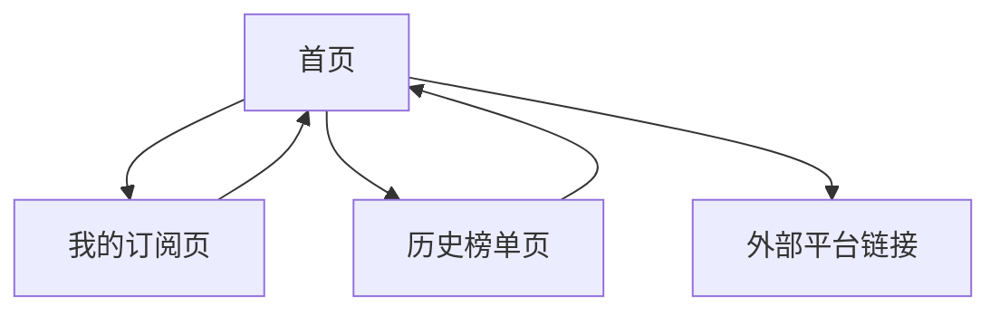

# mo契摸鱼热榜 - 产品需求文档

## 1. Product Overview
mo契摸鱼热榜是一个基于VVhan热榜聚合API的多平台热门内容聚合应用，为用户提供知乎、微博、B站等主流平台的实时热榜信息。
- 解决用户需要在多个平台间切换查看热门内容的痛点，提供一站式热榜浏览体验，支持个性化订阅和主题切换功能。
- 目标用户为关注热点资讯的互联网用户，特别是需要快速获取多平台热门信息的职场人士和内容创作者。

## 2. Core Features

### 2.1 User Roles
| Role | Registration Method | Core Permissions |
|------|---------------------|------------------|
| 游客用户 | 无需注册 | 可浏览所有平台热榜，使用基础功能 |
| 注册用户 | 邮箱注册或GitHub登录 | 可订阅平台、保存偏好设置、查看历史榜单 |

### 2.2 Feature Module
我们的mo契摸鱼热榜包含以下主要页面：
1. **首页**：热榜聚合展示、平台切换标签、搜索功能、主题切换
2. **我的订阅页**：用户登录、订阅平台管理、个人设置
3. **历史榜单页**：日期选择器、历史热榜查看

### 2.3 Page Details
| Page Name | Module Name | Feature description |
|-----------|-------------|---------------------|
| 首页 | 热榜展示区 | 调用VVhan API获取所有平台热榜数据，以卡片形式展示标题、来源平台、热度值、跳转链接 |
| 首页 | 平台切换标签 | 提供知乎、微博、B站等平台的Tab切换，支持单平台或全部平台查看 |
| 首页 | 顶部导航栏 | 包含搜索框、主题切换按钮、用户登录入口、偷摸模式切换 |
| 首页 | 搜索功能 | 支持在当前热榜内容中进行关键词搜索和筛选 |
| 我的订阅页 | 用户认证 | 集成Supabase Auth，支持邮箱注册和GitHub第三方登录 |
| 我的订阅页 | 订阅管理 | 用户可选择订阅的平台，保存到subscriptions表，首页仅显示订阅内容 |
| 我的订阅页 | 个人设置 | 主题偏好、偷摸模式设置、通知设置等个人配置 |
| 历史榜单页 | 日期选择器 | 提供日历组件选择查看历史日期的热榜数据 |
| 历史榜单页 | 历史数据展示 | 从hotlist表读取指定日期的热榜存档数据并展示 |

## 3. Core Process

**游客用户流程：**
用户访问首页 → 查看所有平台热榜 → 点击感兴趣的内容跳转到原平台 → 可切换平台标签筛选 → 可使用搜索功能

**注册用户流程：**
用户登录 → 进入我的订阅页面选择关注平台 → 返回首页查看订阅内容 → 可查看历史榜单 → 可调整个人设置

**管理员流程（后续）：**
系统定时调用VVhan API → 存储热榜数据到Supabase → 为用户提供历史查询功能

## 4. User Interface Design

### 4.1 Design Style
- **主色调**：#3B82F6（蓝色）作为主色，#10B981（绿色）作为辅助色
- **按钮样式**：圆角按钮设计，支持悬停和点击状态变化
- **字体**：系统默认字体，标题使用16-20px，正文使用14px，小字使用12px
- **布局风格**：卡片式布局，顶部固定导航栏，左侧平台切换，主内容区域网格布局
- **图标风格**：使用Heroicons或Lucide图标库，简洁线性风格

### 4.2 Page Design Overview
| Page Name | Module Name | UI Elements |
|-----------|-------------|-------------|
| 首页 | 热榜展示区 | 网格布局的卡片组件，每个卡片包含标题、平台标签、热度数字、外链图标，支持悬停效果 |
| 首页 | 平台切换标签 | 水平滚动的Tab组件，激活状态有下划线和颜色变化，支持全选/取消全选 |
| 首页 | 顶部导航栏 | 固定定位，包含Logo、搜索框、主题切换开关、用户头像/登录按钮 |
| 我的订阅页 | 订阅管理 | 复选框列表形式，每个平台有图标和名称，选中状态有视觉反馈 |
| 历史榜单页 | 日期选择器 | 日历弹窗组件，高亮有数据的日期，支持快速选择最近7天 |

### 4.3 Responsiveness
产品采用移动优先的响应式设计，支持桌面端、平板和手机端适配。在移动端优化触摸交互，卡片间距适中便于点击，导航栏在小屏幕下收缩为汉堡菜单。