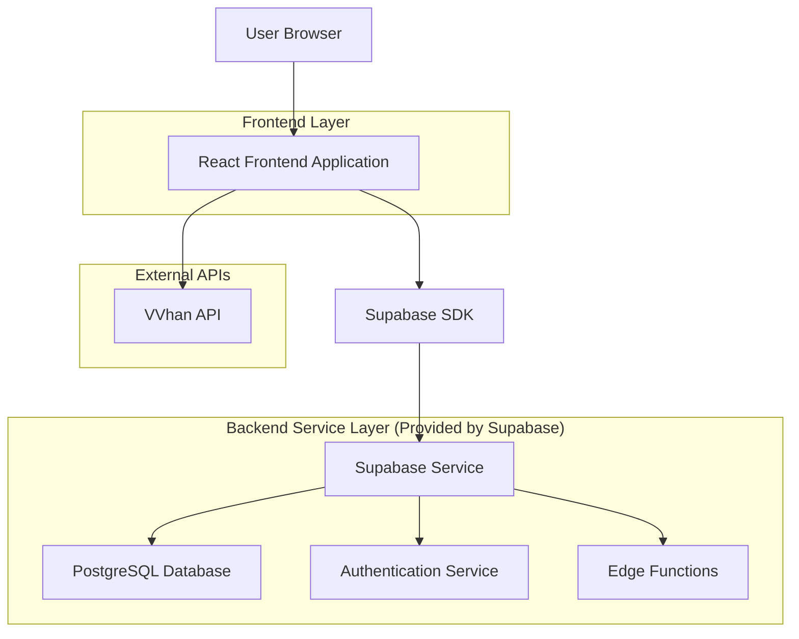
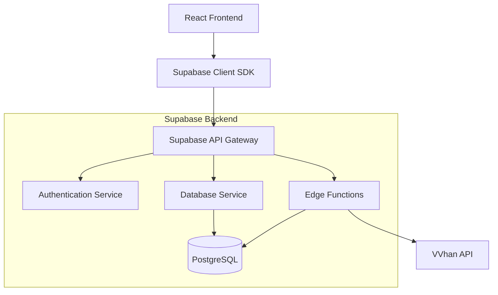
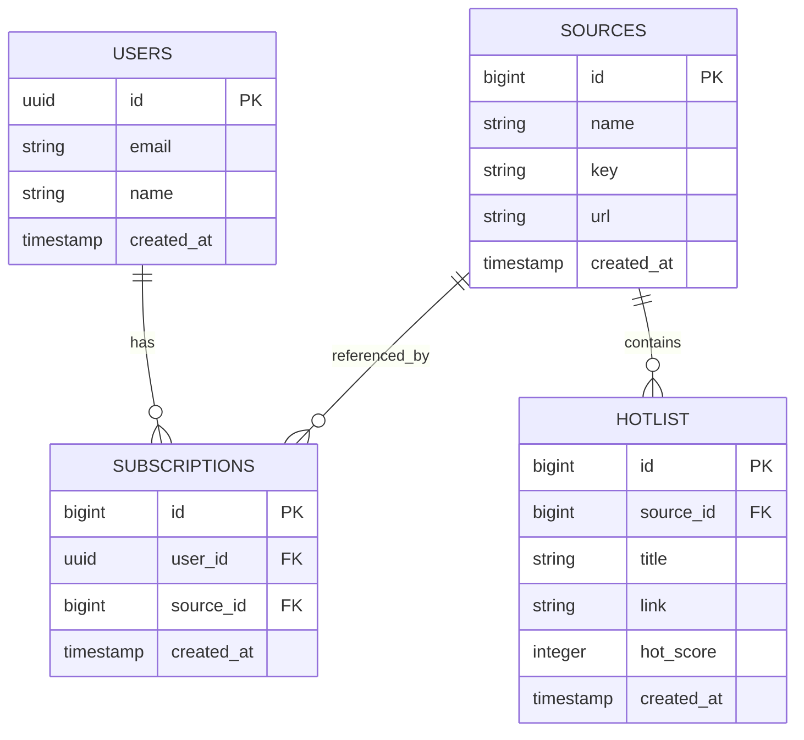

# mo契摸鱼吧 - 技术架构文档

## 1. Architecture design



## 2. Technology Description

* Frontend: React\@18 + TailwindCSS\@3 + Vite + React Query + Zustand

* Backend: Supabase (PostgreSQL + Auth + Edge Functions)

* External API: VVhan热榜聚合API

* Deployment: Vercel (Frontend) + Supabase Cloud

## 3. Route definitions

| Route         | Purpose            |
| ------------- | ------------------ |
| /             | 首页，显示热榜聚合内容和平台切换功能 |
| /subscription | 我的订阅页面，用户登录和订阅管理   |
| /history      | 历史榜单页面，查看指定日期的热榜存档 |
| /login        | 用户登录页面（如果需要独立登录页）  |

## 4. API definitions

### 4.1 External API

**VVhan热榜聚合API**

```
GET https://api.vvhan.com/api/hotlist/all
```

Response:

| Param Name | Param Type | Description  |
| ---------- | ---------- | ------------ |
| success    | boolean    | API调用是否成功    |
| data       | object     | 包含各平台热榜数据的对象 |

Example Response:

```json
{
  "success": true,
  "data": {
    "知乎热榜": [
      {
        "title": "如何看待某某事件",
        "url": "https://zhihu.com/question/123456",
        "hot": 12345
      }
    ],
    "微博热搜": [
      {
        "title": "某明星新闻",
        "url": "https://weibo.com/123456",
        "hot": 98765
      }
    ],
    "B站热榜": []
  }
}
```

### 4.2 Supabase API

**用户订阅管理**

```
POST /rest/v1/subscriptions
```

Request:

| Param Name | Param Type | isRequired | Description       |
| ---------- | ---------- | ---------- | ----------------- |
| user\_id   | uuid       | true       | 用户ID，来自auth.users |
| source\_id | bigint     | true       | 平台来源ID            |

**获取用户订阅**

```
GET /rest/v1/subscriptions?user_id=eq.{user_id}
```

**历史热榜查询**

```
GET /rest/v1/hotlist?created_at=gte.{date}&created_at=lt.{next_date}
```

## 5. Server architecture diagram



## 6. Data model

### 6.1 Data model definition



### 6.2 Data Definition Language

**平台来源表 (sources)**

```sql
-- 创建平台来源表
CREATE TABLE sources (
  id BIGINT GENERATED ALWAYS AS IDENTITY PRIMARY KEY,
  name TEXT NOT NULL,
  key TEXT UNIQUE NOT NULL,
  url TEXT NOT NULL,
  created_at TIMESTAMP WITH TIME ZONE DEFAULT NOW()
);

-- 创建索引
CREATE INDEX idx_sources_key ON sources(key);

-- 初始化数据
INSERT INTO sources (name, key, url) VALUES
('知乎热榜', 'zhihu', 'https://www.zhihu.com/hot'),
('微博热搜', 'weibo', 'https://weibo.com/hot'),
('B站热榜', 'bilibili', 'https://www.bilibili.com/v/popular/rank/'),
('抖音热榜', 'douyin', 'https://www.douyin.com/hot'),
('百度热搜', 'baidu', 'https://top.baidu.com/board'),
('头条热榜', 'toutiao', 'https://www.toutiao.com/hot-event/');
```

**热榜内容表 (hotlist)**

```sql
-- 创建热榜内容表
CREATE TABLE hotlist (
  id BIGINT GENERATED ALWAYS AS IDENTITY PRIMARY KEY,
  source_id BIGINT REFERENCES sources(id),
  title TEXT NOT NULL,
  link TEXT NOT NULL,
  hot_score INTEGER,
  created_at TIMESTAMP WITH TIME ZONE DEFAULT NOW()
);

-- 创建索引
CREATE INDEX idx_hotlist_source_id ON hotlist(source_id);
CREATE INDEX idx_hotlist_created_at ON hotlist(created_at DESC);
CREATE INDEX idx_hotlist_hot_score ON hotlist(hot_score DESC);
```

**用户订阅表 (subscriptions)**

```sql
-- 创建用户订阅表
CREATE TABLE subscriptions (
  id BIGINT GENERATED ALWAYS AS IDENTITY PRIMARY KEY,
  user_id UUID REFERENCES auth.users(id) ON DELETE CASCADE,
  source_id BIGINT REFERENCES sources(id) ON DELETE CASCADE,
  created_at TIMESTAMP WITH TIME ZONE DEFAULT NOW(),
  UNIQUE(user_id, source_id)
);

-- 创建索引
CREATE INDEX idx_subscriptions_user_id ON subscriptions(user_id);
CREATE INDEX idx_subscriptions_source_id ON subscriptions(source_id);
```

**Row Level Security (RLS) 策略**

```sql
-- 启用RLS
ALTER TABLE subscriptions ENABLE ROW LEVEL SECURITY;
ALTER TABLE hotlist ENABLE ROW LEVEL SECURITY;

-- 订阅表权限策略
CREATE POLICY "Users can view own subscriptions" ON subscriptions
  FOR SELECT USING (auth.uid() = user_id);

CREATE POLICY "Users can insert own subscriptions" ON subscriptions
  FOR INSERT WITH CHECK (auth.uid() = user_id);

CREATE POLICY "Users can delete own subscriptions" ON subscriptions
  FOR DELETE USING (auth.uid() = user_id);

-- 热榜表权限策略
CREATE POLICY "Anyone can view hotlist" ON hotlist
  FOR SELECT USING (true);

-- 平台来源表权限
GRANT SELECT ON sources TO anon;
GRANT SELECT ON sources TO authenticated;

-- 热榜表权限
GRANT SELECT ON hotlist TO anon;
GRANT SELECT ON hotlist TO authenticated;

-- 订阅表权限
GRANT ALL PRIVILEGES ON subscriptions TO authenticated;
```

